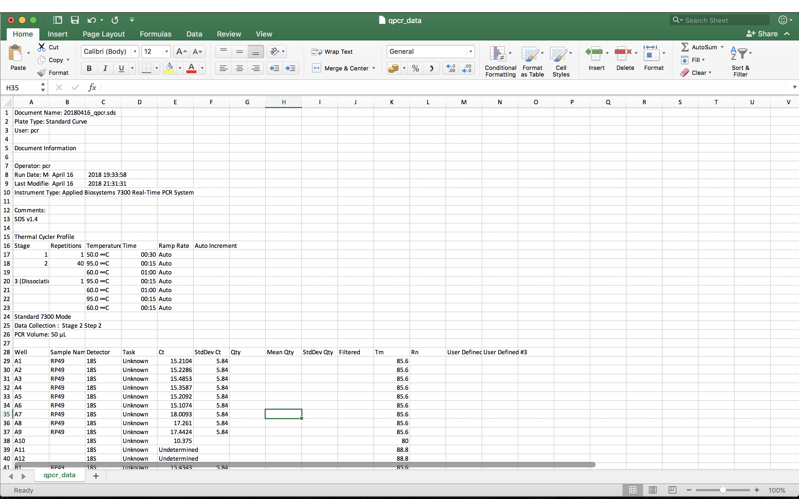
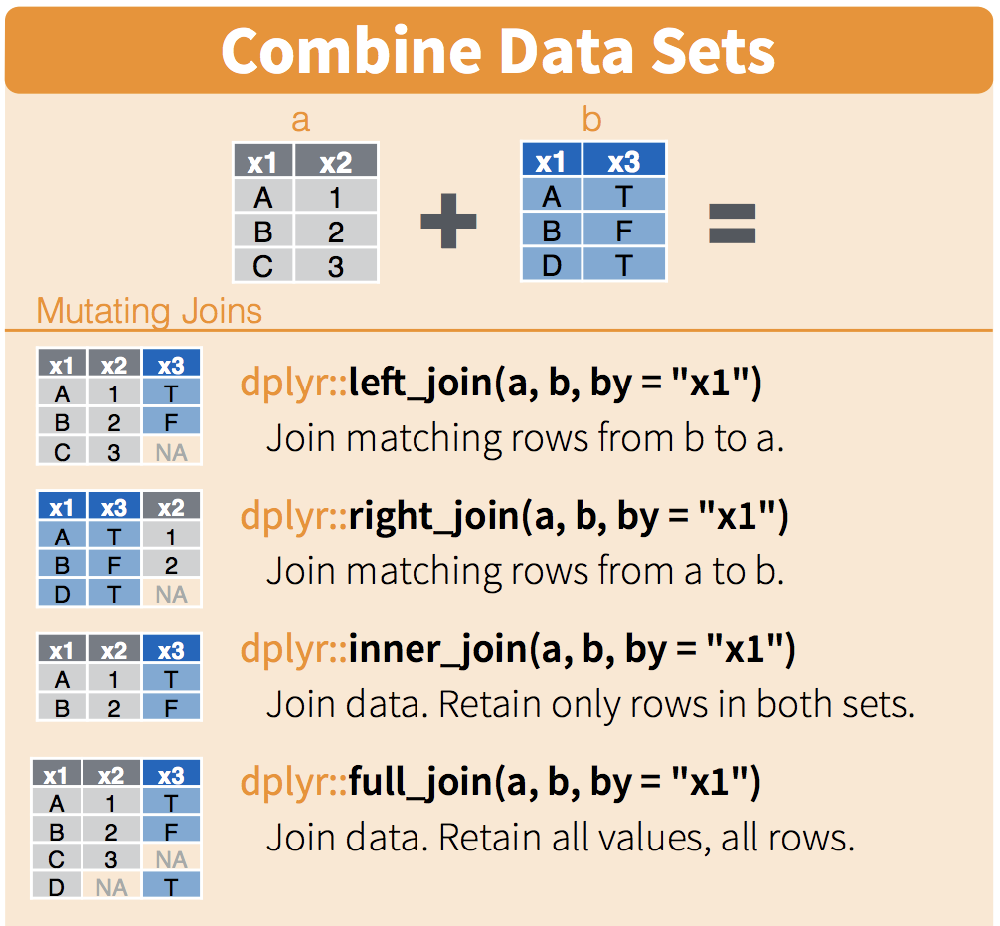

---
# Please do not edit this file directly; it is auto generated.
# Instead, please edit 01-import-data.md in _episodes_rmd/
title: Importing qPCR data and experimental designs into R
teaching: 40
exercises: 15
questions:
- "How can I get my qPCR data into R?"
objectives:
- " To import data using `read.csv()` with the `skip` argument."
- " To create a data frame with the experimental design."
- " To combine data frames using the `left_join()` function from `dplyr`."
keypoints:
- "Use the `skip` argument to skip lines when reading in a text file."
- "Plots can be used to inspect the contents of large data frames."
- "The `separate()` fucntion from `tidyr` can be used to separate variables contained in a single column."
- "Data frames can be combined based on matching variables."
source: Rmd
---

We're going to use R to analyse some RT-qPCR data. Download the file `qpcr_data.csv` and put it in your `data` directory. This contains qPCR data as exported from the software on the qPCR machine. First, we'll open this file in Excel or a text editor and take a look at it. Note that different machines / software versions will export data in different formats or with different organisation, so this may look different to the qPCR data that you're used to.

The file contains metadata about the qPCR run, as well as the results of that run. The metadata is useful to have for reference, but in order to analyse the data in R, we just want to import the tabular data lower down in the file. The table of results starts on line 28 of the file.

We can use the `read.csv()` function to read in the data, like we did in the R lessons. Take a look at the help for the `read.csv()` function.

~~~
?read.csv
~~~
{: .language-r}

We can use the `skip` argument to skip lines at the start of the file.

~~~
qpcr_data <- read.csv("data/qpcr_data.csv", skip = 27)
head(qpcr_data)
~~~
{: .language-r}

~~~
  Well Sample.Name Detector    Task      Ct StdDev.Ct Qty Mean.Qty
1   A1     RNAi1-1      18S Unknown 15.2104      5.84  NA       NA
2   A2     RNAi1-2      18S Unknown 15.2286      5.84  NA       NA
3   A3     RNAi1-3      18S Unknown 15.4853      5.84  NA       NA
4   A4     RNAi2-1      18S Unknown 15.3587      5.84  NA       NA
5   A5     RNAi2-2      18S Unknown 15.2092      5.84  NA       NA
6   A6     RNAi2-3      18S Unknown 15.1074      5.84  NA       NA
  StdDev.Qty Filtered   Tm Rn User.Defined..2 User.Defined..3
1         NA          85.6 NA              NA              NA
2         NA          85.6 NA              NA              NA
3         NA          85.6 NA              NA              NA
4         NA          85.6 NA              NA              NA
5         NA          85.6 NA              NA              NA
6         NA          85.6 NA              NA              NA
~~~
{: .output}

This is a simple qPCR experiment to check whether a knockdown of a target protein is effective. The samples include two different RNAi treatments and a control, as you can see in the `Sample.Name` column. However, information on what primers were used is missing from this file.

In this case, we know that rows A-D were set up with primers for a housekeeping gene, and rows E-H were set up using primers for the target gene of the knockdown. We can create another data frame containing this information and combine it with the qPCR data.

~~~
primer_key <- data.frame(row = c("A", "B", "C", "D", "E", "F", "G", "H"),
                         primers = c(rep("HK", 4), rep("test", 4)))
~~~
{: .language-r}

In order to combine the two data frames, we need to separate the "Well" information in the data into information on what row and column each well is found in. The `separate()` function from the `tidyr` package can be used to split a column of a data frame into multiple columns. 

> ## The `tidyr` package
> `tidyr` is a package designed to help you create tidy data frames. We're not 
> going to use any other functions from the `tidyr` package here, but you can find 
> out more about it on [the package homepage](https://tidyr.tidyverse.org/) or in 
> the [Software Carpentry `tidyr` lesson](http://swcarpentry.github.io/r-novice-gapminder/14-tidyr/index.html).
{: .callout}

~~~
library("tidyr")
tidy_data <- separate(qpcr_data, Well, into = c("row", "column"), 
                      sep = 1, convert = TRUE)
head(tidy_data)
~~~
{: .language-r}

~~~
  row column Sample.Name Detector    Task      Ct StdDev.Ct Qty Mean.Qty
1   A      1     RNAi1-1      18S Unknown 15.2104      5.84  NA       NA
2   A      2     RNAi1-2      18S Unknown 15.2286      5.84  NA       NA
3   A      3     RNAi1-3      18S Unknown 15.4853      5.84  NA       NA
4   A      4     RNAi2-1      18S Unknown 15.3587      5.84  NA       NA
5   A      5     RNAi2-2      18S Unknown 15.2092      5.84  NA       NA
6   A      6     RNAi2-3      18S Unknown 15.1074      5.84  NA       NA
  StdDev.Qty Filtered   Tm Rn User.Defined..2 User.Defined..3
1         NA          85.6 NA              NA              NA
2         NA          85.6 NA              NA              NA
3         NA          85.6 NA              NA              NA
4         NA          85.6 NA              NA              NA
5         NA          85.6 NA              NA              NA
6         NA          85.6 NA              NA              NA
~~~
{: .output}

Now we have a column called "row", containing row numbers, in our data frame with the qPCR data, and in the `primer_key` data frame. These can be used to join the two data frames together.

(Image from RStudio's [data wrangling cheatsheet](https://www.rstudio.com/wp-content/uploads/2015/02/data-wrangling-cheatsheet.pdf).)

~~~
library("dplyr")
~~~
{: .language-r}

~~~

Attaching package: 'dplyr'
~~~
{: .output}

~~~
The following objects are masked from 'package:stats':

    filter, lag
~~~
{: .output}

~~~
The following objects are masked from 'package:base':

    intersect, setdiff, setequal, union
~~~
{: .output}

~~~
tidy_data <- left_join(tidy_data, primer_key, by = "row")
~~~
{: .language-r}

~~~
Warning: Column `row` joining character vector and factor, coercing into
character vector
~~~
{: .error}

Now we've combined the datasets. Let's make a quick plot to check that everything looks as we expect it to. We can use `geom_tile()` from the `ggplot2` package to re-create the qPCR plate layout in a plot.

~~~
library(ggplot2)
ggplot(tidy_data, aes(x = column, y = row, fill = primers, label = Sample.Name)) +
  geom_tile() +
  geom_text()
~~~
{: .language-r}

